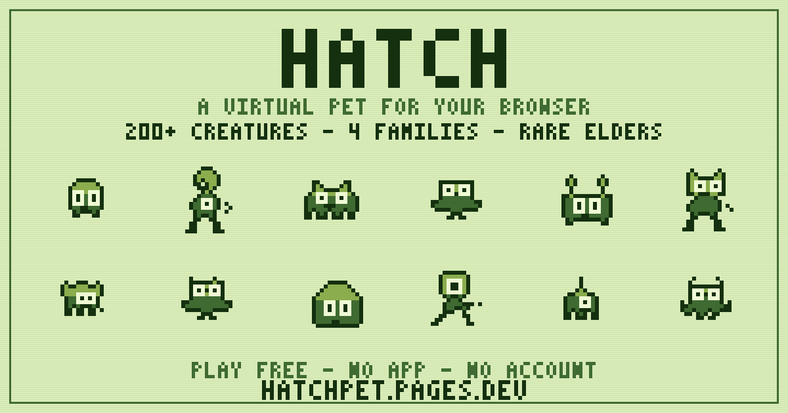

# 🥚 HATCH

A '90s-style **virtual pet that lives in your browser**. Hatch an egg, raise your creature the old-fashioned way — feed it, clean up after it, play games, train it, put it to bed — and **how you care for it decides what it becomes**. 211 creatures across 4 families and 32 evolution lines, including rare "Elder" final forms.

**▶ Play:** https://hatchpet.pages.dev · **🗺️ Bestiary map:** https://hatchpet.pages.dev/evotree · **🎮 itch.io:** https://hatchpet.itch.io/hatch



## What it is
- **211 creatures · 4 families · 32 lineages · branching evolution** — Blobkin (blobs), Saurian (dragons), Beastial (beasts), Skywing (fliers).
- Care mechanics (feed / clean / play / train / sleep), day–night, moods & illness, mini-games.
- **Care-based evolution:** a data-driven species graph decides each creature's path from how you raise it.
- **No backend, no accounts, no ads.** Single self-contained HTML file, `localStorage` saves with offline catch-up, PWA-installable.

## Tech notes
- One `hatch.html` file: a canvas **1-bit renderer** with auto-derived shading, on a 4-shade Game Boy-green palette.
- **Data-driven evolution graph** (`DEX`): species + unlock conditions live in a data table, so adding creatures is mostly data — the roster grew from 55 → 211 forms this way.
- **Sprites are code, not images:** each creature is an ASCII silhouette + eye/mouth rects, rendered by the same shader at runtime and at build time.
- **Render-QA pipeline** (the interesting part): every sprite is validated by two automated gates before it ships —
  1. **Strict inset eye gate** — each eye must sit fully inside the body with a 1px border (so eyes always read as a face, never float on an edge).
  2. **Connectivity gate** — each body must be a single 4-connected component (no floating or diagonal-only pixels).
  Node scripts render sprite sheets to PNG using the app's *real* shader/palette, so what's reviewed is exactly what ships.

## Repo layout
- `hatch.html` — the entire game (source of truth).
- `redraw_blobkin.js`, `render_*_branch.js`, `render_*_chart.js` — sprite authoring + render-QA scripts (each emits a PNG chart to eyeball).
- `assemble_dex.js`, `patch_*.js`, `validate_hatch.js`, `verify_render.js` — build/wire/validate pipeline.
- `gen_evotree.js` — generates the bestiary/evolution map (`evotree.html`) from the `DEX`.
- `make_assets.js`, `make_gif.js`, `make_teaser.js`, `make_itch_bg.js` — share images / promo assets (pure-Node PNG encoders, no image libs).
- `*-chart.png`, `*-branch.png` — rendered reference sheets per family/branch.

## Build & deploy
No dependencies — everything uses built-in Node (`fs`, `zlib`, `vm`). Deployed on Cloudflare Pages:
```
node validate_hatch.js                 # integrity + sprite gates
cp hatch.html pages/index.html
npx wrangler pages deploy pages --project-name=hatchpet --branch=main --commit-dirty=true
node gen_evotree.js                    # refresh the bestiary map
```

## License
© Samuel Firn. All rights reserved. Original code and artwork — genre homage to '90s virtual pets (Tamagotchi/Digimon), no third-party assets.
